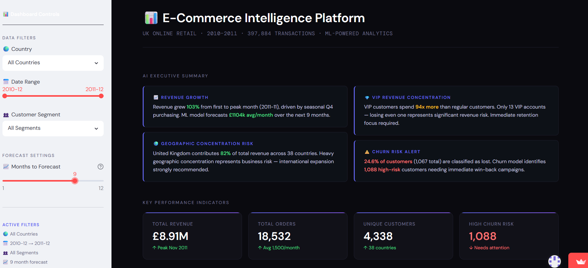
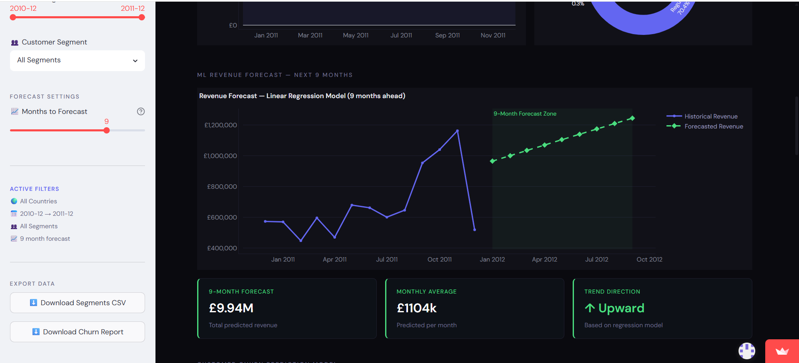
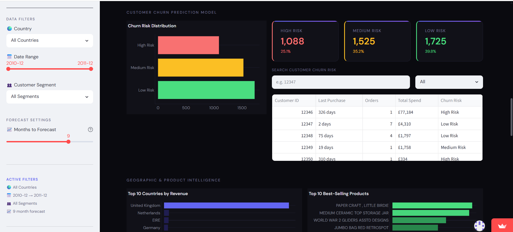

# 📊 E-Commerce Intelligence Platform

> ML-powered analytics dashboard analyzing 397,884 retail transactions with customer segmentation, revenue forecasting, and churn prediction.

🔴 **[Live Demo → harshini-ecommerce.streamlit.app](https://harshini-ecommerce.streamlit.app)**

---

## 📌 Project Overview

This project transforms raw e-commerce transaction data into actionable business intelligence using machine learning and interactive visualizations. Built as a full end-to-end data science project — from raw CSV to deployed web application.

**Dataset:** UCI Online Retail Dataset — 541,909 transactions from a UK-based online gift retailer (2010–2011)

---

## ✨ Features

| Feature | Description |
|---|---|
| 🤖 AI Executive Summary | Dynamic business insights generated from real data |
| 📈 Revenue Forecasting | Linear Regression model predicting 1–12 months ahead |
| 👥 Customer Segmentation | K-Means clustering with RFM analysis across 4,338 customers |
| ⚠️ Churn Prediction | Rule-based churn model identifying high/medium/low risk customers |
| 🔍 Interactive Filters | Filter by country, date range, and customer segment |
| 📥 Data Export | Download segment and churn reports as CSV |
| 📊 Behaviour Analysis | Revenue patterns by day of week and hour of day |
| 💡 Business Recommendations | 6 actionable recommendations derived from data insights |

---

## 🛠️ Tech Stack

- **Language:** Python 3.11
- **Dashboard:** Streamlit
- **Visualizations:** Plotly
- **Data Processing:** Pandas, NumPy
- **Machine Learning:** Scikit-learn
- **Models:** Linear Regression, K-Means Clustering, RFM Analysis

---

## 🚀 Run Locally

```bash
# Clone the repository
git clone https://github.com/HarshiniBommineni/ecommerce-intelligence-platform.git
cd ecommerce-intelligence-platform

# Install dependencies
pip install -r requirements.txt

# Run the app
streamlit run app.py
```

---

## 📂 Project Structure
ecommerce-intelligence-platform/
│
├── app.py                              # Main Streamlit dashboard
├── requirements.txt                    # Python dependencies
├── data/
│   ├── data.csv                        # Raw transaction data (541,909 rows)
│   └── customer_segments.csv           # ML-generated customer segments
├── notebooks/
│   ├── 01_explore.ipynb                # EDA and data cleaning
│   └── 02_customer_segmentation.ipynb  # K-Means clustering model
└── screenshots/                        # Dashboard screenshots
---

## 🧠 Machine Learning Models

### 1. Customer Segmentation — K-Means Clustering
- Built RFM (Recency, Frequency, Monetary) features for 4,338 customers
- Used Elbow Method to determine optimal k=4 clusters
- Identified 4 segments: Champions, VIP, Regular, and Lost customers
- VIP customers spend **94x more** than regular customers on average

### 2. Revenue Forecasting — Linear Regression
- Trained on 13 months of historical monthly revenue data
- Predicts up to 12 months ahead with adjustable forecast horizon
- Interactive slider lets users choose forecast period in real time

### 3. Churn Prediction — Rule-Based Model
- Classifies all 4,338 customers into High, Medium, or Low risk
- Based on recency and purchase frequency thresholds
- Identified 1,088 high-risk customers needing immediate win-back campaigns
- Searchable customer table with churn risk scores

---

## 💡 Key Business Insights Discovered

- Revenue grew **103%** from January to peak month (November 2011)
- United Kingdom contributes **82%** of total revenue across 38 countries
- Only **13 VIP customers** generate **94x more** revenue than regular customers
- **24.6% of customers** show churn indicators with no purchases in 150+ days
- Thursday generates the highest weekly revenue
- Peak ordering hours are between **10am and 12pm**

---

## 📸 Dashboard Screenshots

### Main Dashboard


### Revenue Forecast


### Churn Prediction Model


---

## 👩‍💻 About the Developer

**Harshini Bommineni**
MS Computer Science — Data Science Specialization
University of Missouri-Kansas City (UMKC)

- 🔗 [Live App](https://harshini-ecommerce.streamlit.app)
- 💼 [LinkedIn](https://www.linkedin.com/in/harshini-bommineni)
- 🐙 [GitHub](https://github.com/HarshiniBommineni)

---

## 📄 License

This project is open source and available under the [MIT License](LICENSE).